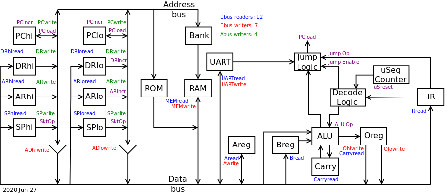
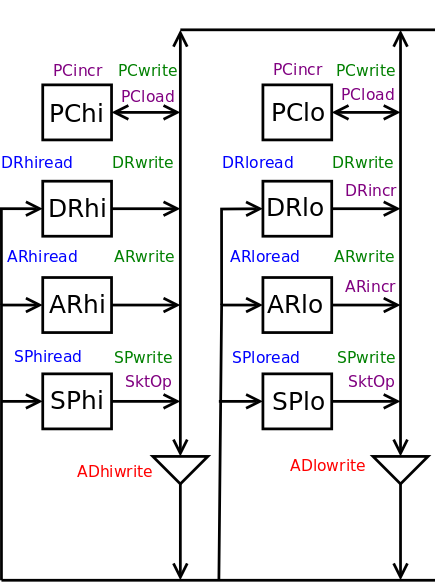
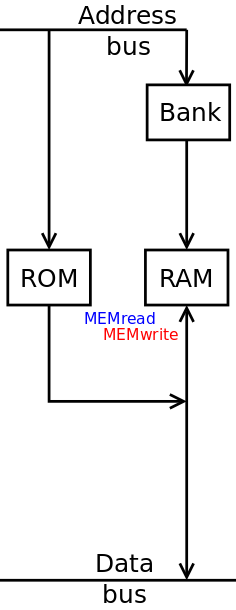
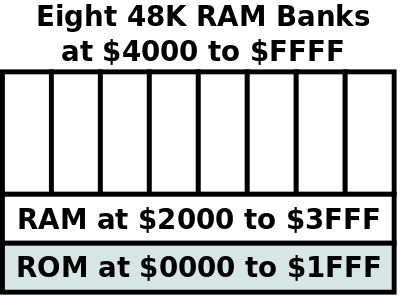
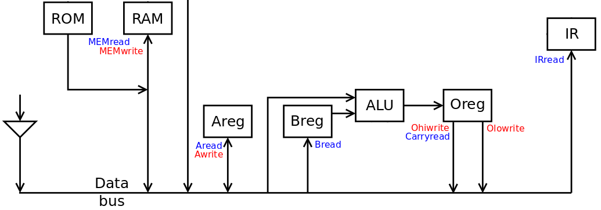
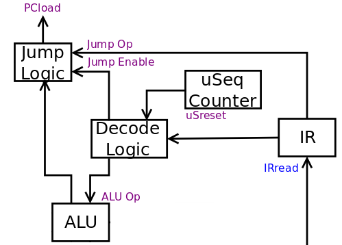

# FISC2: An 8-bit TTL CPU with Some 16-bit Instructions

FISC2 is a microseqenced CPU built from discrete TTL-level components.
It provides
 + recursive **F**unctions,
 + **I**ndexed addressing,
 + **S**tack operations, and
 + some instructions on 16-bit data values

as well as the usual load/store and arithmetic operations, comparisons,
branches and jumps.

## High-level Overview



The above image shows a high level view of the architecture. On the left are the
components that write addresses to the address bus. In the middle is the ROM
and RAM which writes to the data bus. At the bottom right are the two 8-bit data
registers, A and B and the ALU. Finally, at the top-right is the control logic
for the CPU.

Four components can place an address on the address bus, and their control lines
are named in green.

Seven components can write data on the address bus, and their control lines
are named in red.

Twelve components can read from the data bus, and their control lines are named in
blue.

Finally, the purple control lines are for other actions such as incrementing
registers.

## The Address Bus and Registers



There are four 16-bit registers which can write to the 16-bit address bus:
 1. The Program Counter (PC)
 2. The Address Register (AR)
 3. The Destination Address Register (DR)
 3. The Stack Pointer (SP)

All three are divided into 8-bit high and low registers. This allows
the Address Register, Destination Register and Stack pointer halves to
write to and read from the 8-bit data bus through the buffers shown as
triangles. The PC can only load from the address bus.

The PC provides the address of the next instruction in memory. It can load
a new value (i.e. jump), increment to the next address or hold its value.

The AR provides the address for data items in memory; this is typically
used as the *source* of CPU data. It can load a new value, hold its value,
or increment its value.

The DR also provides the address for data items in memory; this is
typically used as the *destination* of CPU data. It can load a new value,
hold its value, or increment its value.

The SP points at a location in memory where data can be pushed or popped.
It can load a new value, increment, decrement or hold its value.

## Memory



FISC2 has a 16-bit address bus, so only 64K bytes can be accessed by
the CPU at any time. The ROM is mapped to the bottom 8K of the address
space. The RAM device is 512K bytes in size. The Bank register adds and
extra three address bits to the address bus and allows the CPU to "see"
eight banks of RAM above the mapped ROM.

However, for the 8K of memory immediately above the ROM, this is always
mapped to the same memory bank. This provides a shared buffer which is
always visible regardless of the value in the Bank register.

The memory map for FISC is thus:



Based on the address on the address bus and the selected bank, either the ROM
or the RAM access a location in memory. If the `MEMwrite` control line is
enabled, this value is written on the data bus.

## The Data Bus



The data bus is 8 bits wide and provides the path for data movement. This includes:

 + data to and from the address registers,
 + data to and from the memory devices,
 + data to and from the UART (not shown),
 + data to the A and B data registers, and from the A register,
 + data to the instruction register (IR), and
 + data from the O register which holds the ALU's output.

## The ALU


The ALU provides 16 operations on two data inputs, of which one is always
the B register. The other data input is the data bus itself. This allows
the ALU input to be one of:

 + the 8-bit halves of the PC, AR, DR and SP registers,
 + the A register,
 + a memory location,
 + the UART, or
 + the output of a previous ALU operation (via the two halves of the 16-bit
   O register).

The ALU's data output is buffered by the 16-bit O register. For most ALU
operations, only the low half of the O register is used. The top half
is used to hold results for multiplication, division and shifts. The
16-bit O register thus allows the CPU to perform ALU operations on two
8-bit values where there is a 16-bit result.

The Carry register records the carry of an ALU addition or subtraction
of an ALU operation. This information can then be used by following
additions and subtractions. 

When performing a comparison between two operands, the ALU stores
information about the comparison in the top half of the O register. This
can then be used for conditional jump and branch instructions.

## Indexed Addressing

As the AR and SP registers can write to and read from the data bus,
we can use the ALU along with the Address Register (AR) to perform indexed
addressing. Consider the load operation `A= <address>,B`, where the base address
is indexed by the B register's value. Also assume that AR and B are already loaded
with the address and index. This sequence of microinstructions will perform the
indexed load:

```
  Oreg = ARlo + B, carry recorded in Carry register
  ARlo = Oreg
  Oreg = ARhi + 0, previous carry brought in
  ARhi = Oreg
  A = Memory[ AR ]
```

## Stack Operations

At boot time, the 16-bit Stack Pointer is initialised to $0000 so
that the first push on the stack will occur at $FFFF, i.e.
the top of memory. The Stack Pointer can increment and decrement itself without
requiring the ALU. Let's look at how we can push the A register on the stack.
This would be performed by this sequence of microinstructions:

```
  SP--
  Memory[ SP ] = A
```

Similarly, popping a value from the stack and into the A register
would be performed by this sequence of microinstructions:

```
  A= Memory[ SP ]
  SP++
```

The Stack Pointer is connected to the data bus in the same way as the
Address Register, and the Stack Pointer can be loaded from the data bus.
This allows functions to have local variables and arguments. Consider
a function with two 8-bit arguments (`arg1` and `arg2`) and three 8-bit
local variables (`loc1`, `loc2` and `loc3`). We can arrange the stack
to look like this:

```
        | arg2 |   SP,3
        +------+
        | arg1 |   SP,2
        +------+
        |  Old |
        +      +
  SP -> | PC+1 |
        +------+
        | loc3 |   SP,-1
        +------+
        | loc2 |   SP,-2
        +------+
        | loc1 |   SP,-3
        +------+
```

The five variables can be accessed using indexed addressing with the Stack
Pointer as the base, as shown in the right-hand column above.

## Function Calls

FISC provides function calls where the return address is stored on the
stack. There are two instructions: JSR to jump to a subroutine and RTS
to return from the subroutine.

Given that the Program Counter will increment itself as part of each
instruction, the sequence of microinstructions for JSR is:

```
  SP--
  Memory[ SP ] = PChi
  SP--
  Memory[ SP ] = PClo
```

and the sequence of microinstructions for RTS is:

```
  PClo = Memory[ SP ]
  SP++
  PChi = Memory[ SP ]
  SP++
```

## Control Logic



The control logic block diagram for FISC2 is shown in the above image.
Each instruction is one byte, followed by zero or more bytes that
encode addresses, constant values, offsets etc.

FISC2 is a microsequenced CPU with up to sixteen microinstructions per
high-level instruction. The microsequence counter starts at zero and
counts up to fifteen, but it can be reset to zero by the Decode Logic.

On microinstruction zero, the Instruction Register is loaded from memory
over the data bus:

```
  IR = Memory[ PC++ ]
```

The Instruction Register and the microsequence counter form a lookup
address to choose the next microinstruction in the Decode Logic.

Four bits from the Decode Logic are sent to the ALU as the
operation to perform. Thus, on every microinstruction the ALU makes a calculation.
However, the Decode Logic also control when the O register stores this result
and the the Carry buffer stores any carry result.
This allows us to selectively use the ALU as required.

When doing a comparison, the ALU generates six bits which are sent to the
Jump Logic:

 + Zero
 + Not Zero
 + Negative
 + Negative or Zero
 + Not Negative, Not Zero
 + Zero or Not Negative

The ALU compares two operands by subtracting the second operand from the
first. The above outputs can be used to make these decisions:

 + `operand1 == operand2`, when `operand1 - operand2` is zero
 + `operand1 != operand2`, when `operand1 - operand2` is not zero
 + `operand1 < operand2`, when `operand1 - operand2` is negative
 + `operand1 <= operand2`, when `operand1 - operand2` is negative or zero
 + `operand1 > operand2`, when `operand1 - operand2` is not negative, not zero
 + `operand1 >= operand2`, when `operand1 - operand2` is zero or not negative

As with the ALU, the Decode Logic controls when the Jump Logic output
actually modifies the Program Counter's value. So even though the Jump
Logic is always evaluating the comparison bits from the ALU, we
won't jump unless the Decode Logic tells us to.

### The Decode Logic

The Decode Logic outputs sixteen control bits. Some of these are demultiplexed
to provide many more control bits. The Jump operation is provided directly by
the low three bits of the instruction.

At present, these are the control groups provided by the Decode Logic:

 + The ALU operation: 4 bits, 3:0
 + The address bus writers: 2 bits, 5:4
 + The stack operation: 2 bits, 7:6
 + The data bus writers: 4 bits, 11:8
 + The data bus readers: 4 bits, 15:12

There are less than sixteen components that read from the data bus; similarly,
there are less than sixteen components that write to the data bus.
So, some of the bit patterns for these two control groups are used to generate
other control lines, such as:

 + incrementing the AR and DR registers
 + asking the Jump Logic to change the PC if required
 + resetting the microsequencer at the end of a series of microinstructions

As there are less than four stack operations, one of the four stack operation
patterns controls when the PC increments.

## Operations on 16-bit Data Values

Given that FISC2 has an 8-bit data bus, it is sensible that we treat FISC2 as
an 8-bit CPU. But what makes FISC2 interesting is that both the AR and DR address
registers can increment. This provides scope to write instructions that perform
operations on 16-bit data values.

Here is an example 8-bit data operation and a possible sequence of microinstructions
for it:

```
# Add the 8-bit value from the source memory address to the value
# at the destination memory address, and store the result back in
# the destination memory address. Assume that the destination address is first.

    DRlo= Mem[ PC++ ]		# Get the destination and source addresses
    DRhi= Mem[ PC++ ]
    ARlo= Mem[ PC++ ]
    ARhi= Mem[ PC++ ]
    Clear the carry
    B= Mem[ AR ]		# Get one operand into the B register
    O= Mem[ DR ] + B		# Perform the ALU operation
    Mem[ DR ]= O		# Store the result back to memory
```

Now let's look at how we can extend this to do an operation on two 16-bit
data items in memory:

```
# Add the 16-bit value stored in little-endian format from the source memory address
# to the 16-bit value at the destination memory address, and store the result back in
# the destination memory address. Assume that the destination address is first.

    DRlo= Mem[ PC++ ]		# Get the destination and source addresses
    DRhi= Mem[ PC++ ]
    ARlo= Mem[ PC++ ]
    ARhi= Mem[ PC++ ]
    Clear the carry
    B= Mem[ AR ]		# Get one operand into the B register
    O= Mem[ DR ] + B		# Perform the ALU operation
    Mem[ DR ]= O		# Store the result back to memory
    AR++			# Move AR and DR to point to the high
    DR++			# byte of the data
    B= Mem[ AR ]		# Get high byte of operand into the B register
    O= Mem[ DR ] + B		# Perform the ALU operation using the stored carry
    Mem[ DR ]= O		# and store the result back to memory
```

This is a long microsequence. However, compared to two 8-bit instructions performed
sequentially:

 + the total number of microinstructions performed is slightly less
   as we don't have to load the IR twice or reset the microsequencer twice;
 + the total instruction size in memory is smaller as we don't have to
   store the destination and source addresses twice; and
 + we now have a 16-bit instruction which makes writing assembly code (and
   porting a compiler) much easier.

Not all 8-bit instructions can be rewritten to have a 16-bit equivalent. For example,
the ALU can do an 8-bit multiplication in one microinstruction. However, it cannot
do a 16-bit multiplication. To do this, we will need to perform four 8-bit
multiplication and then add the subsequent results. This will definitely *not*
fit into the sixteen microinstructions available in a single instruction.


