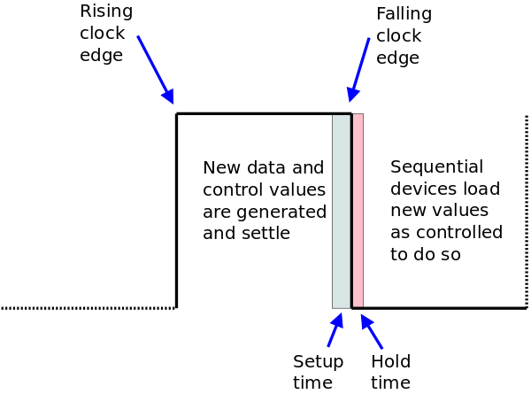

# Implementation of the FISC CPU

This document outlines some of the implementation decisions for the FISC2
CPU. As with the CSCvon8 CPU, one of my goals was to keep the chip count
down. This time, recursive functions, local variables and indexed addressing
are important goals, as these allow me to port a C compiler to the CPU.

## Clock Phases

Before we tour the FISC2 implementation, I think it's important that I cover
how I'm using the two phases of the master clock signal in the implementation.
There is a square-wave master clock, called `Clk`, running at 3.57Mhz: in
the first half of each clock cycle the clock's value is high, and in the second
half the clock's value is low. And, of course, there is a falling edge between
the first and second halves.


In the first half of the clock cycle when the clock pulse is high, we propagate
new values from a (typically sequential) source of data through one or more
combinational devices, e.g the RAM or the ALU. The final result *must* settle before
the end of the first half. This also includes any level-based control values that
will be used in the second half.

The falling edge of the clock pulse is used to load the new data values from the
first half of the clock cycle into the sequential devices that need to load new
values. These devices need to be told to load their values, and so their control
lines (as noted) need to be set before the clock pulse falls. These devices know
to load when they see the clock edge. However, some of them need to see a
rising edge, so we also generate an inverted clock signal `Clkbar` for this reason.



In fact, the values generated in the first half of the clock cycle need to settle
well before the clock transition. This is as most of the sequential devices which use
these values have both a *setup time* and a *hold time*. Each sequential device
has its own values for these two times.

The overall timing of the CPU (and hence its maximum clock speed) is limited
by the delay from when the clock edge rises and when the resulting control and data
values can settle before the start of the setup time. If we don't meet this
timing constraint, we will either load incorrect data or perform actions based
on incorrect control line values.

We can now start the tour of the FISC2 implementation, but bear in mind
which device control lines are level-based (generated in the first clock phase)
and which device control lines are edge-based (and triggered by the falling
clock transition).

*Aside: throughout the rest of the document, control lines which are active
low are indicated by a leading `~` tilde character.*

## The Program Counter


I chose to re-use the [74LS593](https://www.ti.com/lit/gpn/sn74ls593) as the
device for the PC. I'd previously used this in my CSCvon8 design; there it was
[my nemesis](https://minnie.tuhs.org/Blog/2019_04_26_Understanding_74LS593.html).
I think I understand it now.

The 74LS593 is an 8-bit register and incrementing counter with tri-state output.
The tri-state output is controlled by the level-based `~G` input, so we generate
this in the first clock half.

Loading and incrementing the register occur when `RCK` and `CCK` see a
rising edge. So, for the *PClo* component, they are both tied to `Clkbar`.

The register loads mid-cycle if `~CLOAD` is set low: both devices have this tied to
`~PCread`. The *PClo* component increments mid-cycle if `~CCKEN` is set low: this
is tied to `~PCincr`.

When *PClo* overflows from $FF to $00, the `~RCO` line generates a clock
transition. This is connected to *PChi*'s `CCK` so as to make *PChi* increment
as well.

I've tied both devices' `~CCLR` lines to the `~Reset` line to ensure that the PC
initialises to value $0000.

Note that the 74LS593's inputs are also its outputs. This is fine as the PC
only has to write to, and read from, the address bus. But because of this
I had to choose another device for the other address registers.

## The Stack Pointer


For the stack pointer, I had to find a TTL device which is:

 + an 8-bit register,
 + with tri-state output,
 + is also an up/down counter,
 + and can be cascaded to act as a 16-bit device.

Fortunately I found the
[74LS469](http://pdf.datasheetcatalog.com/datasheet/nationalsemiconductor/DS008333.PDF).
Unfortunately, this is now obsolete. I can
get them second-hand, but there are no new device and, sadly, no SOIC packages.
That's a shame as the 74LS469 is quite a nice device.

The 74LS469 has two level-based inputs, `~UD` and `~CBI`. When the `CLK` input
sees a rising edge, here is what happens:

  ~CBI |  ~UD  |  Result
------:|:-----:|--------
    0  |   0   | Decrement
    0  |   1   | Increment
    1  |   0   | Do nothing
    1  |   1   | Do nothing

As two of these four values have the same result, I was able to use one of these
patterns for a second purpose: to generate the `~PCincr` line. I'll explain soon.

`~UD` and `~CBI` are level-based, so I have to generate them in the first half of
the clock cycle. The 74LS469 expects a rising clock edge, so `Clkbar` is used
for this.

*SPlo* gets two control lines `~StkOp0` and `~StkOp1` which are tied to
`~UD` and `~CBI`, respectively. We only need to connect the `~StkOp0` (i.e
increment/decrement) line to *SPhi* because *SPlo* generates a carry/borrow
on the `~CBO` output. We can wire this to *SPhi*'s `~CBI` input to cascade
any increment or decrement.

As with the PC, the tri-state output is controlled by a level-based pin, `~OE`
which is tied to `~SPwrite` and generated in the first half of the clock cycle.

Now, I need to be able to set the Stack Pointer to any value, but typically
$0000 when the CPU initialises. Both *SPlo* and *SPhi*'s have `~LD` lines which
are tied to the control lines `~SPloread` and `~SPhiread`, respectively. When
low, they cause *SPlo* or *SPhi* to read from the data bus.

## The AR and DR Address Registers


I re-used the 74LS469 for the AR and DR registers as they need inputs separate
from their outputs, and they also need to increment.

As they only need to increment, not decrement, I can wire their `~UD` lines low.
They increment when the level-based `~ARincr` and `~DRincr` lines, respectively,
are low in the first half of the clock cycle. Otherwise, they are wired up
the same as the stack pointer devices.

## Memory Devices


The address registers in FISC2 are 16 bits wide, so technically there is only
a 64Kbyte address space. This is divided up into 8K of ROM starting at address
$0000, followed by 56K of RAM.

Both the
[AT28C64B EEPROM](http://ww1.microchip.com/downloads/en/DeviceDoc/doc0270.pdf)
and the [CY62148 static RAM](https://www.digchip.com/datasheets/parts/datasheet/115/CY62148-pdf.php)
read the address from the
address bus, select a memory location and write out to the 8-bit data bus.

Output on each device is enabled when both:

 + the `~CE` (chip enable) line is low, and
 + the `~OE` (output enable) line is low.

I've chosen to wire both `~OE` lines to `~MEMwrite` and treat both components
as a single "memory" device. There is a control line to the RAM, `~MEMread` wired
to `~WE`, which tells the RAM to read from the data bus and overwrite a memory
location.

## Selecting RAM and ROM, and Bank Switching

What I omitted to describe is how I control the `~CE` (chip enable) line on
both devices. I generate a single `~RAMena` line which is connected to the RAM's
`~CE` line. This is inverted and connected to the ROM's `~CE` line. Either
the RAM is enabled or the ROM, but never both. Now let's look at how
this `~RAMena` line is generated.


We want the bottom 8K of the address space to select the ROM and the rest of the
address space to select the RAM. To do this, I'm using the
[74HCT238](https://assets.nexperia.com/documents/data-sheet/74HC_HCT238.pdf)
3:8 demux on the left.

The 74HCT238 generates high outputs based on its input. The `A0` to `A2` inputs
are wired to the top three address bus lines, dividing the address space up into
eight 8K regions.

For the bottom 8K, `A0` to `A2` will be all low. This causes the `Y0` output
from the 74HCT238 to go high. As this is wired to the active-low `~RAMena` line,
this disables the RAM and enables the ROM. For all other memory regions, the RAM
is enabled.

Now we get to the bank switch. I wanted to have more than just 56K of available
RAM, and I had to work out how to map it into the 64K address space. Moreover,
I wanted to have a shared region of RAM which was always visible, so that I could
copy in and out of the currently non-visible parts of memory.

I've achieved this with a "bank switch" that generates extra address lines for the
CY62148 which is actually a 512K RAM device. Here is how it works.

I am using a
[74HCT574 8-bit register](https://assets.nexperia.com/documents/data-sheet/74HC_HCT574.pdf)
as a bank switch register; I'm only using
three of the bits that it can store. This register can load from the data bus
when the `Cp` clock input rises. I've wired this to `Bankread` which rises
mid-cycle once the data bus value has settled.

This allows eight "banks" of RAM to be mapped in to the address space, but only one
bank at a time is visible. As it stands, this means that the contents in each bank
can never be visible when a different bank is mapped in. I wanted to have a way
to copy data from one memory bank to another. And here is how this works.

Notice that the `Y1` output from the demux is wired to the `~OE` input on the
bank register. When the address bus has an address in the range $2000 to $3FFF,
this value is high. And as the `~OE` input is active low, this will cause the
output of the 74HCT574 to become high impedance ("high Z").

I've added three 1K pullup resistors to the three address outputs of the
bank register. When these are high impedance, the pullup resistors set their
values high.

The end result is that, when the address bus is in the range $2000 to $3FFF,
the highest of the eight RAM banks will always be selected, regardless of the
value in the bank register. Thus, there is a shared 8K of RAM in the
range $2000 to $3FFF no matter what RAM bank is selected.

# The Address Buffers

I needed the ability to manipulate and to store the values in the four
address registers (PC, SP, AR and DR) in RAM. To do this, I need to be able
to write their values on the data bus. However, the data bus is only 8 bits
wide and the address bus is 16 bits wide.


To do this, I'm using two
[74HCT151 tri-state buffers](https://assets.nexperia.com/documents/data-sheet/74HC_HCT151_Q100.pdf).
One is connected to the
low eight bits of the address bus; the other to the high eight bits. Both
output to the data bus.

The 74HCT151's output is controlled by two active-low lines, `~G1` and `~G2`.
I've set one line low on each buffer. The other is wired to `~ADlowrite` and
`~ADhiwrite`, respectively. I can set one of these in the first half of the
clock cycle. At the same time, I can get one of PC, SP, AR or DR to write a
value on the address bus. Now, half of the address bus value appears on the
data bus.

## The A and B Data Registers


An ALU needs to operands to work on, but we can't transfer two things across
the data bus at the same time. Therefore, we need to store data in at least one
data register. I've put two data registers into FISC, the A and B register.

The A register simply reads from the data bus and writes back to the data bus.
This allows us to get data from memory and keep hold of it for several instructions
without having to fetch it again and again. I used a 74HCT574 8-bit register
for both A and B. Note that each have a rising edge control line, `Aread` and `Bread`
to read from the data bus mid-cycle.

The A register has an active low level-based control line, `~Awrite`, which
enables it to write to the data bus. We have a lot of data bus writers, and
we have to ensure that only one can write on the data bus at any time.

The B register's value goes directly into the ALU, so its output is always
enabled.

## The ALU


The ALU is simply a very big ROM, an
[M27C322 2MB x 16 ROM](https://www.digchip.com/datasheets/parts/datasheet/456/M27C322-pdf.php),
where the results of all operations are pre-computed and stored. I will cover what operations the
ALU performs elsewhere (and put in a link to this at some point).

As inputs, the ALU takes:

 + the 8-bit B value on address lines 0 to 7,
 + the 8-bit data bus value on address lines 8 to 15,
 + four bits indicating the ALU operation on address lines 16 to 19, and
 + a carry-in bit on address line 20.

As outputs, the ALU generates an 8-bit result on data lines 0 to 7, and
another eight bits. For some ALU operations, these encode a comparison result
(e.g. if one operand was bigger than another operand). For other ALU operations,
these bits encode part of the result. As an example of the latter, an 8-bit by
8-bit multiply produces a 16-bit result.

In terms of control, we don't need any control lines for the ALU. The ALU's
output is wired on with `~E` set low. `~GVPP` is wired low to stop the ROM
from being accidentally reprogrammed.

The datasheet for the MC27C322 lists its time from address change to data output
at up to 80nS, so this is one of the longer timing delays in the CPU. Another
is the AT27C1024-70 Decode ROM at 70nS. Together, they mean that the first half
of the clock cycle has to be at minimum 150nS. Then, if we have to fetch data from
the AT28C64B Instruction ROM, we can add another 150nS to that as well!

## The 16-bit Output Register


I use another two 74HCT574 8-bit registers to hold the output of the ALU.
A single rising edge load line, `Oread`, causes them to read the ALU output
mid-cycle when it is settled. Two level-based control lines, `~Ohiwrite`
and `~Olowrite`, tell the registers to write to the data bus. The implication
here is that it takes two clock cycles for the ALU to calculate a result
and for it to cross the data bus to be stored somewhere.

## The Carry

Notice on the previous image that there is a `Cout` signal tied to bit 8
of the ALU output. When we are doing addition or subtraction, this holds
the resulting carry or borrow. Yes, this is already stored in the high half of
the output register discussed above. The problem is that I need this
carry result to be fed back in to the ALU for subsequent additions or
subtractions. However, the output register's output is already connected
to the data bus.


Thus, we need a 1-bit register to hold the carry output. I've chosen to
use half of a
[74HCT74 D flip-flop](https://assets.nexperia.com/documents/data-sheet/74HC_HCT74.pdf).
I'm using the same rising edge load
line, `Oread`, that I was using for the output register to save a control
line. I've also wired the flip-flop's reset line to the system `~Reset`
line, even though this is not really neccessary.

## The Reset Line


Given that I've just mentioned the `~Reset` line, let's see how we
generate it. I am using the
[DS1233 reset device](https://datasheets.maximintegrated.com/en/ds/DS1233.pdf)
for this. It holds the `~Reset` line low until the power supply stabilises,
then waits about 300mS, then raises the `~Reset` line.

The DS1233 device also provides for a manual reset button as
shown in the schematic. When pressed, this drops `~Reset` low,
and it comes up (glitch free) after about 300mS.

## The UART

Our final data device is the
[UM245R UART](https://www.ftdichip.com/Support/Documents/DataSheets/Modules/DS_UM245R.pdf).
This is an expensive device but I like it because it does several things:

 + provides a USB-visible UART for both Linux and Windows at a
   very high bit rate;
 + provides an 8-bit input and output register which is much easier to
   read/write than doing bit-banging;
 + the output is tri-state; and
 + it can also be used as the power supply for the whole CPU.

I am using all four features of the UM245R here. It is connected
to the data bus for both input and output. There are two falling-edge
control lines:

 + `~WR` (connected to `~UARTread`) reads one byte of data from the
   data bus and writes it to the UART; and
 + `~RD` (connected to `~UARTwrite`) reads one byte of data from the
  UART and writes it to the data bus.

When the UART is not writing to the data bus, its output is high Z.

Finally, there are two status lines from the UART:

 + `~RXF` (connected to `~RXready`) is low when the UART has a byte
   ready to place on the data bus; and
 + `~TXF` (connected to `~TXready`) is low when the UART is read to
   read from the data bus and send data down the UART.

## The Control Logic

We have now covered all of the address and data components in the FISC2
implementation. Along the way, I've covered most of the control lines
for these devices. Now we need to turn our attention to how these lines
are generated.

Also, remember that the level-based control lines need to be generated
in the first half of the clock cycle. The edge-based control lines will
either be generated from `Clk` if they need to be falling edges, or
from `Clkbar` if they need to be rising edges.

I did a quick count of the control lines before and I came up with about
thirty-six lines (including some which are groups of lines like the ALU
operation). Somehow, all of these lines have to be asserted or disabled
on each microinstruction. Fortunately, many of the lines can be grouped
together as they are mutually exclusive (e.g. the data bus writers).

## The Instruction Register and Microsequencer


The instruction register, a 74HCT574 register, loads an 8-bit opcode
value at the beginning of each instruction. I'll explain how in a minute.

As each high-level instruction is composed of a sequence of microinstructions,
I use a
[74HCT161 counter](https://www.ti.com/lit/ds/symlink/cd54hc163.pdf)
to produce a increasing 4-bit pattern to index
each microinstruction in the high-level instruction in turn.

The `CEP` and `CET` inputs are tied high to hard-wire the device to always
increment. However, we do need to be able to reset the counter back to zero
at the end of each instruction, and also when we reset the CPU. Luckily,
the 74HCT161 has two control lines which we can use to do both.

The `~PE` edge-based line tells the counter to load a value from the
four `D` input lines when this line falls. I've tied all the `D` lines low.
`~PE` is then tied to the `~uSreset` control line, so when it drops, the
counter is reset.

For the main CPU reset, I've tied the 74HCT161 `~MR` (master reset)
level-based line to the system `~Reset` line. When this is low, the
counter remains at zero.

## The Decode ROM


The 8 bits from the instruction register and the 4 bits from the microsequence
counter form the address to look up a microinstruction in the
[AT27C1024 Decode ROM](http://ww1.microchip.com/downloads/en/devicedoc/doc0019.pdf).
This ROM has 16 bits of output which we need to
expand to produce the 36 control lines I mentioned before.

The AT27C1024 has more than 12 bits of address inputs, so I've tied the
unused ones to zero. It does mean if I need more instructions, or more
microinstructions in each instruction, I've got the ability to implement this!

The `~PGM` line is tied high so that the ROM is not accidentally programmed.
The `~CE` and `~OE` lines are tied low so that the ROM's output is always
enabled.

I mentioned before that the instruction register loads an opcode from the data
bus on the first microinstruction in each insttruction. I make this happen
by programming the Decode ROM so that the first microinstruction in *every*
instruction asserts these control lines:

```
  MEMwrite IRread PCincr     # Read from memory, write to IR, increment PC
```

## Groups of Decode ROM Outputs

If you look at the above diagram, you can see that the Decode ROM's output
can be broken up into five groups:

 + 4 bits identifying the ALU operation;
 + 2 bits identifying the address bus writer;
 + 2 bits for the stack pointer operation;
 + 4 bits identifying the data bus writer; and
 + 4 bits identifying the data bus reader.

As I mentioned earlier, some patterns in each group are spare, and I
repurpose then for other uses which I will explain below.

## The Address Bus Writer Demux


I've covered the available ALU operations elsewhere, so let's move to the
address bus writer demux. The two address bus writer bits from the Decode
ROM come to this half of a
[74HCT139 2:4 demux](https://assets.nexperia.com/documents/data-sheet/74HC_HCT139.pdf).
These control lines need to
be generated in the first half of the clock cycle, so I have wired the
`~E` enable line of the 74HCT139 low so that the output is always on.
You can see the four active-low control lines that this demux generates on
the right.

## The Stack Operation and `~PCincr`

The stack pointer needs two bits to control its increment and decrement
operation, and these come directly out of the Decode ROM. But two of the
four patterns have the same effect on the stack pointer, and I have a spare
74HCT139 half, so here is what I do:


The fourth stack operation pattern is demuxed to become the active low
`~PCincr` control line. I won't be inc/decrementing the stack at the
same time as I increment the PC, so this is fine. As with the other
74HCT139 half, the `~E` enable line is wired low to generate `~PCincr`
in the first half of the clock cycle.

## The Data Bus Writer Demux


We need to choose a device to write to the data bus in the first half
of the clock cycle. The four data bus writer bits from the Decode ROM
are demux'd with a
[74HCT154 4:16 demultiplexer](https://assets.nexperia.com/documents/data-sheet/74HC_HCT154.pdf).
Again, the `~E0` and `~E1` enable lines are wired low so that the output is always on.

The first seven outputs are actual data bus writer control lines.
That leaves nine outputs unused, so I have repurposed two of them
to be the `~ARincr` and the `~uSreset` lines. I didn't put `~DRincr`
here because I wanted to be able to increment the AR and DR address
registers separately.

## The First Data Bus Reader Demux

We have a problem with demuxing the data bus reader lines from the
Decode ROM. Some of the data bus readers need a level-based control
line to be generated before the mid-cycle clock transition. Others
need an rising edge mid-cycle to read the bus. And yet others need
a falling edge mid-cycle to read the bus! This is how I solve this
problem.


The first data bus reader demux deals with those lines that are
level-based. I'm using another 74HCT154 4:16 demultiplexer. Again,
the `~E0` and `~E1` enable lines are wired low so that the output
is always on.

Only the `~XXread` lines are actual data bus reader control lines.
I've borrowed one output to be the `~DRincr` control line.

Also note, in particular, two things. First, output zero is not used:
we need the ability to *not* read from the data bus, e.g. when we are
doing a NOP instruction. Second, only the first half of the sixteen
possible input patterns are decoded. Now, why would this be?

## The Second Data Bus Reader Demux


We don't decode the second half of the sixteen possible input patterns
because they are decoded by this demux! I'm using another 74HCT238 3:8
demux here, and I've done some subtle cleverness along the way.

Remember that the 74HCT238 produces a high output on the line which
is selected by the input pattern. The 74HCT238 also has three output
enable lines: `G1`, `~G2A` and `~G2B`. These have to be high, low and
low (respectively) for one output line to be high. Otherwise, all
eight outputs are held low.

Here is the cleverness. This demux needs to generate the rising
edge lines to control those data bus readers that need them. `~G2B`
is already low, so now we need to deal with `G1 and `~G2A`.

`G1` is tied to the highest of the four data bus reader bits from
the Decode ROM. This means the demux output can only go high when
the input is a pattern from the *second half* of the possible
data bus reader patterns. Clever, huh?!

`~G2A` is now tied to the master `Clk` signal. Now, the output
can only go high when the `Clk` signal falls, and this occurs
mid-cycle. We now have one output which only goes high when selected
and is a rising edge mid-cycle: just what we wanted.

## The Inverter


These is just one niggling unsolved issue with the second data bus
reader demux. Some of the edge-based control lines we need are
falling edge, but the 74HCT238 only generates rising edges. To
solve this, I have a
[74HCT240 octal inverter](https://assets.nexperia.com/documents/data-sheet/74HC_HCT240.pdf)
to change the direction of the
edges. This is also used to change the level of some other control
lines.

## The Jump Logic

One thing that I've left to last in this tour of the FISC2
implementation is how the CPU performs jumps. Here are the
reasons that the FISC2 CPU can jump:

 + when the first ALU operand (I'll call "A") is equal to
   the second ALU operand (I'll call "B");
 + when A is not equal to B;
 + when A is greater than B;
 + when A is greater than or equal to B;
 + when A is less than B;
 + when A is less than or equal to B;
 + when the UART is not ready to transmit data;
 + when the UART has no data to be read; and
 + unconditionally (i.e. a normal JMP).

Firstly, this is nine jump reasons, i.e. one more that I can encode
in three bits. Secondly, there isn't any spare output bits from
the Decode ROM, so I have to think of a way to generate a bit
pattern for each of the above jump reasons that can be easily
decoded. Here is what I chose.


I've wired three of the instruction register's output bits
directly to the jump logic. This gives me eight bit patterns
to represent the different jumps. It also means that *any*
instruction can cause a jump if the `~Jmpena` line is
enabled.

For the ALU-based jumps, there is a special ALU operation `A-Bcomp`
which subtracts the "B" operand from the "A" operand and stores
these result flags in the output register if the comparison is:

 + Zero
 + Not Zero
 + Negative
 + Negative or Zero
 + Not Negative, Not Zero
 + Zero or Not Negative

I chose these flags results because:

 + `A == B`, when `A - B` is zero
 + `A != B`, when `A - B` is not zero
 + `A < B`,  when `A - B` is negative
 + `A <= B`, when `A - B` is negative or zero
 + `A > B`,  when `A - B` is not negative, not zero
 + `A >= B`, when `A - B` is zero or not negative

So these six flags become six of the inputs to the jump logic,
which is a
[74HCT151 8:1 multiplexer.](https://assets.nexperia.com/documents/data-sheet/74HC_HCT151_Q100.pdf)
Two other inputs to this device are the two UART status lines, `~RXready` and `~TXready`.

When the `~Jmpena` control line goes low, and when one of the
eight possible jump inputs is high, the `~Q` output goes
low and sets `~PCread` low. This causes the PC to load a new
value, thus "jumping" the PC to a new location.

Which jump input is chosen depends on the three bits from
the instruction opcode. This forces the opcode to represent
certain jump types. For example, an opcode of $X0 or $X8
(when the three IR bits are all zero) can only do an `A == B`
conditional jump. Similarly, an opcode of $X1 or $X9 can only
do an `A != B` conditional jump.

There is one jump which I haven't discussed yet, and that's
the unconditional jump. To make this happen, I use that
ALU operation that always generates a zero outut; this also
always sets the Zero flag. Therefore, the microcode sequence
to jump to address $XXXX is:

```
Opcode $48:
  MEMwrite IRread PCincr     # Read from memory, write to IR, increment PC
  MEMwrite ARloread PCincr   # Read the low/high address into the AR
  MEMwrite ARhiread PCincr
  Zero Oread	             # Set the Zero flag in the output register
  Ohiwrite ARwrite Jmpena    # Put AR on address bus, jump as Zero set
  uSreset		     # Reset the microsequencer back to zero
```

## Summary

That ends the tour of the RISC2 implementation. I think (hope)
that I've covered all the devices and, in particular, I hope
I have covered how I've organised all the control lines in order
to make them all work.

If something doesn't make sense, or if you would like something
to be clarified, please let me know.
