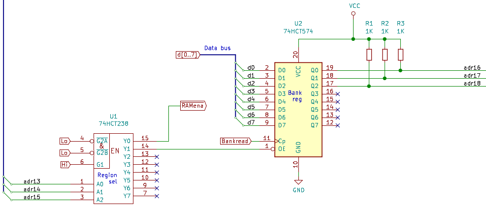

# Warren's Working Journal for the FISC2 CPU

This is my working journal for the FISC2 CPU. It will (hopefully) go
from when I first conceived of the design on paper through to soldering the
components on a PCB and running real instructions, and beyond. I didn't write
it for public consumption; the journal helps me keep track of what I'm doing,
what issues I still need to address etc. Anyway, read on for weeks of
frustration and occasional success ...

## Sun 24 May 22:20:03 AEST 2020

I've forked my FISC code over to here so I can work on FISC2 in parallel.
This is because I want to explore the idea of a second address register
which will allow me to write "16-bit" instructions.

Imagine that there was a second pair
of address registers, DRhi/DRlo as well as the existing ARhi/ARlo.
Imagine that they could *increment* as well as load (like the PC).

Given the above, we could write these instructions:

### addw $DDDD, $SSSS

Add a 16-bit value from memory location `$SSSS` to memory location
`$DDDD`. Microcode:

  0. Load IR
  1. Load ARlo, clear carry
  2. Load ARhi
  3. Load B from Mem [AR]
  4. Load DRlo
  5. Load DRhi
  6. Oreg= Mem[DR]+B, save carry
  7. Mem[DR]= Oreg, increment AR
  8. Load B from Mem [AR], increment DR
  9. Oreg= Mem[DR]+B (with saved carry)
 10. Mem[DR]= Oreg, reset uSeq counter

The instruction would be 5 bytes long and take 11 microinstructions.
If we had to use byte instructions, we'd have to do:

```
   mov b, $SSSS
   add $DDDD, b		# Zeroes the carry in microcode
   mov b, $SSSS+1
   adc $DDDD+, b	# Add with carry
```

That's 12 bytes long and `5+6+5+6=22` microinstructions: significantly
longer in time and space. Hmm. I'm liking this. We would have to
replace the two 74HCT574 SOIC AR chips with four 74LS593 DIP chips.
More space on the PCB will be required.
Digikey sells SN74LS593DWR SOIC-20 for $20 each. Element 14 doesn't
sell them. Mouser (X-On) in quantities of 4,000+ only.

What this would mean is that the design would have both 8-bit and
16-bit instructions. Maybe I should completely hide the A and B
registers?

We have enough spare decode outputs to make this work, I think. I'd
have to sit down and make sure it was possible.

## Mon 25 May 10:31:02 AEST 2020

We need another address bus writer, that's easy:
 

We need another two data bus readers, that's also easy. But I need a control
line which will increment all *four* AR and DR chips at the same time. I'm
thinking of something like this:

 

I'm borrowing a spare data bus reader control line to use as the increment
line. Let's see if I can write the microcode for `addw $DDDD, $SSSS`:

```
# Address bus writers (2 bits, 8:7)
PCwrite = 0000
ARwrite = 0080
SPwrite = 0100
DRwrite = 0180

# Data bus readers (4 bits, 12:9)
#           0000 means no data bus reader
#           Several values are unused
Jmpena    = 0400
ARhiread  = 0600
ARloread  = 0800
SPhiread  = 0A00
SPloread  = 0C00
Aread     = 0E00
Bread     = 1000
IRread    = 1200
MEMread   = 1400
Carryread = 1600
UARTread  = 1800
DRhiread  = 1A00
DRloread  = 1C00
ARincr    = 1E00

# Add 16-bit word from source to destination (accumulator)
XX movw_word_word:				    # uInst 0 same as before
     MEMwrite ARloread PCincr			    # Get src address into AR
     MEMwrite ARhiread PCincr
     MEMwrite DRloread PCincr			    # Get dest address into DR
     MEMwrite DRhiread PCincr
     ARwrite MEMwrite Bread Stkhold Zero Carryread  # B= Mem[ AR ], zero carry
     DRwrite MEMwrite A+B Carryread Stkhold	    # O= Mem[ DR ] + B
     DRwrite Owrite MEMread Stkhold		    # Mem[ DR ] = O
     ARincr					    # Increment AR and DR
     ARwrite MEMwrite Bread Stkhold 		    # B= Mem[ AR+1 ]
     DRwrite MEMwrite A+B Stkhold		    # O= Mem[ DR+1 ] + B
     DRwrite Owrite MEMread Stkhold		    # Mem[ DR+1 ] = O
     uSreset Stkhold
```

That's 13 microinstructions. I forgot the `uSreset`, and we have to do the
`ARincr` separately: we can't do it while we are using AR or DR. This looks
promising. Now let's look to see if the control lines are active high or low.

## Mon 25 May 11:04:37 AEST 2020

We'd be using the 74LS593, the same as the PC. All three lines are active low:
*PCread*, *PCwrite* and *PCincr*. So *DRwrite* from the address bus writer
demux is active low: OK. And all lines out from the data bus reader demux
are active low, so all OK there too. No extra inverters!

I might try wiring this up in the Verilog and see what happens. I've done the
wiring and the existing examples are all OK with the AR registers. Now let's
try the DR register and the above instruction.

## Mon 25 May 12:25:17 AEST 2020

The wiring is done, took a while to get it fixed. I had to add one more
microinstruction, `Zero Carryread Stkhold` to the list as `Carryread` is
overloaded on the data bus reader demux, sigh. The test program is:

```
        mov a,  $FF     # $8000 is #$10FF
        mov $8000, a
        mov a,  $10
        mov $8001, a
        mov a,  $75     # $8002 is #$6675
        mov $8002, a
        mov a,  $66
        mov $8003, a

        addw $8000, $8002	# 14 uInsts, 5 bytes long
```

which is the same as `example06.s` which does the above (not the `addw`) and:

```
        mov a, $8000    #  5 uInsts
        mov b, $8002	#  5 uInsts
        clc		#  3 uInsts
        add a, b        #  4 uInsts
        mov $8000, a    #  5 uInsts
        mov a, $8001    #  5 uInsts
        mov b, $8003    #  5 uInsts
        add a, b        #  4 uInsts
        mov $8001, a    #  5 uInsts, total 41 uInsts
```

Yes I could improve this by doing:

```
        mov b, $8002	#  5 uInsts
	clc		#  3 uInsts
	add $8000, b    #  6 uInsts
        mov b, $8003    #  5 uInsts
	add $8001, b    #  6 uInsts, total 25 uInsts
```

Also, I could write one of the `add`s to be an add with no carry, so let's
remove the 3-cycle `clc` but add one cycle to the first `add`. That's now
23 uInsts. The new 14-cycle version is 64% faster and only 42% the size
of the one without the `clc`. So, definitely an improvement.

I just updated `csim` with this design change. All tests still pass.

## Mon 25 May 13:30:46 AEST 2020

What this means is that we can hide the A and B registers and make the CPU
look like a 2-operand CISC platform with 8-bit and 16-bit operations.

I'm trying to think of opcode names....

```
    loadb $8000, 'x'		# Load 8-bit constant to memory
    loadb $8000, #$45		# Load 8-bit constant to memory
    loadw $8000, #$1234		# Load 16-bit constant to memory
    movb  $8000, $8002		# Copy byte from src to dest memory
    movw  $8000, $8002		# Copy word from src to dest memory
    addb  $8000, $8002		# 8-bit add from src to dest memory
    addw  $8000, $8002		# 16-bit add from src to dest memory
```

Maybe we use the source operand syntax to work out the instruction?

```
    movb $8000, 'x'		# Load 8-bit constant to memory
    movb $8000, $8002		# Copy byte from src to dest memory
    movw $8000, #$1234		# Load 16-bit constant to memory
    movw $8000, $8002           # Copy word from src to dest memory
    addb $8000, #$12		# 8-bit add constant to dest memory
    addb $8000, $8002		# 8-bit add from src to dest memory
    addw $8000, #$1234		# 16-bit add constant to dest memory
    addw $8000, $8002		# 16-bit add from src to dest memory
```

Yes, I think I like this. I'll need to spend some time on constructing
all the new opcodes.

## Mon 25 May 13:55:58 AEST 2020

I think I really do need to capture the high byte of an 8-bit multiply.
Example: `0x30 * 0x23 = 0x690`. Now imagine we want to do a 16-bit
multiply, which we can do with FOIL:

```
	AABB *         Example:   0203 *
        CCDD                      0065
        ----                      ----
        PPPP = BB*DD              012F = 03 * 65
      QQQQ00 = BB*CC            000000 = 03 * 00
      RRRR00 = AA*DD            00CA00 = 02 * 65  
    SSSS0000 = AA*CC          00000000 = 02 * 00 (not needed for 16-bit result)
                              --------
                                  CB2F
```

But we need that `01` from the `012F` result. I was thinking of wiring up
the Carry register to the top 8 bits of ALU result. When we do an 8-bit
multiply, Oreg gets the low 8-bit result and Creg gets the top 8-bits.
But now how do we output it somewhere?

I've already hardwired one bit to the `Cin` ALU input. I was thinking of
making the Creg another databus writer. But that means:

 + either its output is disabled, so no `Cin` value, or
 + its output is on the data bus, so `Cin` only visible when
   we *cannot* use the data bus to read in one ALU operand. Sigh.

It's **so** close! I could make the Creg into an 8-bit "Preg" (P comes
after O) for the top 8-bits, and just use a 74HCT74 D flip-flop for the
carry store. Assuming I do this, that's two DP chips and one D flip-flop,
so now 28 chips. It also means I can grab 8 more bits of output from the ALU!
Not sure that I need it, but it could be useful. Example, shifts and rolls.

## Tue 26 May 11:35:23 AEST 2020

I've added the new I/O handling code to `csim` and it works. Right now, the
Perl simulator has a 1-bit carry. So I'll now go and capture the top 8-bits
of the ALU output. I've renamed the Oreg as the Olow register and there is now
an Ohigh register. Both get set on every clock cycle. The old Owrite databus
writer control line is now Olowrite and there is an Ohiwrite control line too.

All the tests and compile stuff still works. I'll now go modify `gen_alu` to
output the top 8-bits on a multiply. Done. Now to see if it works.

Just transliterated the old `prhex()` function into the new assembly. Argh,
we don't have `1f` jump labels. I'm definitely going to have to rewrite
the assembler at some point.

Ah, small problem. The original Oreg gets updated on each clock cycle. If
we do this for the Ohigh register, we will lose it before we get a chance to
save it somewhere. I think I'll use Carryread as its load line. Now to change
`csim`. Done.

I've changed the `mul a, b` instruction to store the 16-bit result in B/A,
high bits in B. And it works:

```
$ ./cas fred.s; ./csim
45*56=172E
```

That means technically I can try to write a 16-bit by 16-bit multiply
sequence by doing cross-multiplication (FOIL). I'll do that later.

Hah. It also means that I can make a "divmod" instruction and get the results
of both at the same time. Thus, I can make room for one more ALU operation!

Back to the cross multiply. An example:

```
         12  34      Location $8001/$8000
      *  67  89      Location $8003/$8002
---------------
         1B  D4      34*89	# Store in $8004/$8005
     09  A2          12*89	# Store in $8006, add to $8005
     14  EC          34*67	# Store A temp, add B to $8006, reload A etc.
 07  3E              12*67	# Store in $8007, add to $8006
---------------
 07  5C  A9  D4

$07 $06 $05 $04      Locations $80xx

```

Argh. I coded it up, but I get the result `075BA9D4`. I can see why:
there are going to be carries in each byte column. Argh! This means that
we will have to work right to left.

Fixed, it takes 23 instructions to do it. I had to change the "mul"
instruction and store the hi/lo results in A/B instead of in B/A.

## Thu 28 May 11:24:02 AEST 2020

Now I need to make all of this work in the Verilog version, and bring in
the 74HCT74 flip-flop model. Done. I've also added in the OH register.
I've run all the examples and all the hi-level programs in both the Perl
simulator and in the Verilog version; they produce the same output. So
that seems to indicate the the design is OK.

What to do next? I think what I need to do now is to create a bunch of
8-bit and 16-bit instructions which are suitable for a compiler to
target. One problem I've already thought of are the conditional jumps.
For the 8-bit ones:

```
  jeq addr1, addr2, newpc
```

makes sense to compare 8-bit two locations and jump if `addr1`'s value is
greater than `addr2`. To do the same for two 16-bit locations isn't going
to be so easy. We certainly can't do it in one microinstruction.

For example, consider comparing values $1200 and $2300 which are obviously
not equal. If we compare the low bytes, they are the same. But we can't
jump until we can compare the high bytes.

I don't want to encode the addresses twice in successive instructions:

```
  # Jump to L1 if both 16-bit src and 16-bit dest are the same
  jne src, dest, L2
  jeq src+1, dest+1, L1
L2: ...
    ...
L1: ...
```

But the AR/DR registers are already loaded, so perhaps I can write
separate instructions and increment the AR/DR. Something like:

```
  # Jump to L1 if both 16-bit src and 16-bit dest are the same
  jne src, dest, L2
  ijeq L1
L2: ...
    ...
L1: ...
```

where `ijeq` means "increment the AR/DR registers and do the comparison.
It does look like I have to encode two jump addresses though, but I can
live with that.

## Thu 28 May 11:24:12 AEST 2020

What I might also do is look into `acwj` and see what instructions it already
uses, and see if I can write similar instructions here.

```
  .text
  .data
  .globl
  .byte
  .word
  .long
  push register
  pop register
  move between registers
  load constant into register
  load address into register
  widen a value
  narrow a value
  shift left/right, different sizes (will be fun!)
  negate a value, different sizes (will be fun!)
  convert value into zero or 1 (AND with $0001?)
```

are the ones that I'll have to worry about, plus the multiplication,
division and remainder of course. Argh, I'll also need to deal with
indexed addressing! I think I might need to first work out an assembly
syntax.

## Sat 30 May 08:08:05 AEST 2020

I rewrote `cas` yesterday and now have `ncas`. Still a work in
progress. I've started on the new microcode. I have some of
the 8-bit instructions. I've also got some of the 16-bit
instructions working, too. I've just got 16-bit adds and
subtracts done. I'm trying to work out how to fit a 16-bit
left shift in to the 16 microinstructions. Here is my idea:

```
# lslw_ww: shift value at DR left by value at AR
  Load DR and AR values
  Load B with AR value
  Do O= Mem[DR] << B, 16-bit result in Ohi/Olo (Carryread)
  Save Olo to Mem[DR]
  ARincr
  Do O= Mem[DR] << B no Carryread. Now we need to OR Ohi and Olo
  B= Olo
  O= Ohi << B
  Save Olo to Mem[DR]
```

I wonder if I can do ARincr at the same time that I use the
AR/DR registers, as that would save a clock cycle. No, it's
an overload on the databus read demux so it's not a separate
control line unfortunately.

## Sat 30 May 09:36:13 AEST 2020

Following on from the above, I think I just had a good idea. Right now
we have a single control line `uSreset` to reset the microsequencer.
And we have two `StkOp` control lines which both control the stack pointer
chips and increment the PC. We've had to overload the databus read demux
with things like `Carryread` and `ARincr`.

Also, right now the stack pointer chips are clocked by `Clkbar`.

What if we changed the `uSreset` line to be a `StkOp` line which is used to
clock the stack pointer chips. Then the other two lines will become `MiscOp`
lines. All three lines go to a 74HCT138 3:8 demux.

This gives us the low four outputs as control lines. When the `StkOp` line
goes high, this will be a stack operation. So we could have:

```
  000:  unused
  001:  uSreset
  010:  ARincr
  011:  Carryread?
  100:	Stkincr
  101:  Stkdecr
  110:  Stkhold, could be reused
  111:  Stkhold, could be reused
```

Given that `Stkhold` is essentially a no-op on the stack, this gives us
three more active-low control lines and possibly a fourth if `Carryread`
stays where it is. We could also move `Jmpena`, but I don't know if moving
`Carryread` or `Jmpena` gives us any extra parallelism.

This would change the 4:16 demux chip we currently have to a 3:8 demux, so
it doesn't add to the chip count.

## Sat 30 May 09:51:05 AEST 2020

I was also looking at what else on the board I could make into SOIC.
The '593s are available in SOIC packages. I can also get RAM in a
SOIC package, the CY62128E 128Kx8 device. There is also the CY62148G
512Kx8 in a SOIC package. Argh, if only I can think of a way to bank
switch it so that I could implement a filesystem in the RAM. Both also
have very low standby current, so maybe I could arrange some battery
circuit to hold the memory?!

On the TTLers forum, I asked this question: *Could anybody recommend a
suitable resistor value to pull up a high-Z TTL output so that it is
treated as "high"? Or, similarly, a pull down to "low" resistor value? I
need a 4-bit register where I can force the output to be either "0000"
or "1111" based on a control line. I thought I could use the 74HCT574
register which has tri-state output. So when the output is in high-Z I
could force it to be all ones or all zeroes. This would save a chip.*

Alastair Hewitt writes: *The resistor value is part of an RC circuit
where the C is the parasitic capacitance of the gate/bus. This is in the
15-50pF range depending on your chips. I'm seeing around 25-30pF in my
design. It takes about 0.5RC to go from 0 to 2V with the resistor tied
to 5V. A value of 1K will get there in about 15nS. Initially I wanted to keep
it close to the 74F propagation delay of the 74F chips (4nS) and used 270 ohm
resistors. These worked fine but got kind of hot on the final PCB layout.
1k was a good trade off. I remember now that 1K was too slow on the
breadboard, so you may want to go lower if prototyping. The PCB is more
compact and less parasitic and 1K is just fast enough.*

If this worked, I could keep the 138 3:8 demux for the `ROMena` output.
I could use one of the other outputs to be the output enable for a
74HCT574 which would be the bank selector. I think. Now thinking that
I might need to invert that. Anyway, the idea would be to have ROM at
the bottom 8K, then force bank 0 for the next 8K, then the remaining
48K would be bank switched.

We could run the programs in the top 48K of bank 0 and use the RAM
at location 8K to 16K as the buffer to copy in/out from the other banks.

If an extra inverter is a problem, I could change to the 74HCT238 3:8
demux with active high outputs. Let's see:

```
  top 3 addrbus bits -> 74HCT238, active high outputs

  When 000 input, Q0 is high, otherwise Q0 is low. Use this as RAMena
  and invert it to get ROMena.

  When 001 input, Q1 is high, otherwise Q1 is low. Use this as the
  active-low output enable for a 74HCT574 address bank register.
```

So when the address bus top bits are 001, the address bank register
is high-Z. The pullup (or down) resistors force the output to be a
fixed value regardless of the address bank register's actual value.
We will also need a spare databus reader control line to allow the
bank register to read from the data bus. Yes, there is a spare one
and even two if we move `ARincr` to the new three control lines.

I sent this to the TTlers:
*I want to use a 512KB SRAM and an 8K ROM in a design with a 64K address
bus. I want to keep the 8K ROM at location $0000. In the next 8K starting
at $2000 I want a window on the same RAM regardless of the bank switch. For
the remaining 48K I will have a bank switch that selects from one of
eight 48K banks in the 512KB SRAM.

Here is the circuit I am thinking of. Can anybody spot any issues?



The bank switch is a 74HCT574 register which loads from the data bus. It
has tri-state output but I'm using the pull-up resistors as suggested by
Alastair to set the output to "111" when the `~OE` line is high. These
three bits select the RAM bank.

The 74HCT238 is a 3:8 demultiplexor with high outputs. It receives the
top three bits from the address bus.

When the demux input is "000", this sets `~RAMena` high, disabling the
RAM output. An inverter turns this into `~ROMena`, enabling the ROM for
the bottom 8K.

When the demux input is "001", the `Y1` output from the demux is
high. This disables the 74HCT574 register output and forces the selection
of RAM bank "111". Thuus, RAM bank "111" is always used when the top three
address bus bits are "001", i.e. for memory locations $2000 to $3FFF.

For all other values on the address bus, demux `Y0` output is low so
RAM is enabled and demux `Y1` output is low, asserting the bank switch
register values on address lines 16, 17 and 18.*

And here's a memory map:


Assuming that I keep one 48K bank for running code, this leaves
336K of RAM for a file system. That's nearly a whole 360K floppy! So, the
same memory as an Apple ][+, more disk space, a faster clock speed and
some 16-bit instructions! Oh, and the ability to write a C compiler backend
for it.

## Sat 30 May 16:56:52 AEST 2020

I was going to order just the 74HCT574, 74HCT238 and 74HCT04 in DIP package
to test the above. But then I thought: I'm probably going to build FISC2
anyway, so I worked out a BoM and ordered it all from Digikey! Now I've
got to actually design it and lay out the PCB :-)

## Sun 31 May 16:19:47 AEST 2020

Damn, damn, damn! I want 16-bit DR/AR registers that can load from the data
bus, increment and write to the address bus. I thought I could use the
74LS593s as per the PC (and which are in SOIC packages) but no! These
read/write on the _same_ pins! So I can't keep the data and address busses
separate.

The only other incrementing register (in SOIC) I know of is the 74HCT161
which I used in the CSCv2. But these are 4-bit registers. I'd need four
for DR and four for AR. No way. So I will have to order more 74LS469s
in skinny DIP packages from Utsource, as I only have four and I need six.
Damnit! I've ordered six or eight of them.

OK, I've quickly rewired the schematic to have 74LS469s for AR and DR.
For now, I've left `ARincr` as a databus reader demux control line,
because I'll need to add an extra 74HCT138 if I want to demux the
old `StkOp` and `uSreset` lines. If I desperately need extra
microinstructions, I'll add the extra 74HCT138.

## Mon  1 Jun 06:44:56 AEST 2020

I was getting sick of forgetting to put `StkHold` on nearly every
microinstruction, so I modified `gen_ucode` to have a list of lines
to assert by default, and a list of lines that deassert these defaults.
This seems to work.

What I now need to do is to bring all three implementations (Perl,
Verilog, Kicad) into line with each other. I'll probably start with
adding the memory banking to the Perl version. I've added the memory
banking to the Perl version. The next hard bit is the Verilog version
with all the TTL devices to add.

## Mon  1 Jun 13:59:21 AEST 2020

I've left AR/DR as '593s for now (they work) and I've added in the
74HCT238 3:8 demux (active high outputs) and the modified '574 register
(output is high when not enabled). I've also changed the RAM to be 512K.
I also fixed a couple of `csim` bugs. I've written RAM bank test code
and a `bank` instruction. I can write to and read from all the eight
banks, and I can see the shared 8K window from $2000 to $3FFF. This
works in both the Perl and the Verilog versions. Yay!!!

## Mon  1 Jun 14:19:53 AEST 2020

I've replaced the AR/DR with '469s in the Verilog version and they work.
I forgot that `Bankread` was active high so I added it to the inverter
in the Kicad version. So, I *think* all three versions of FISC2 are now
back in sync. Now I need to write more instructions and do more testing.

## Mon  1 Jun 19:28:33 AEST 2020

I've decided to use Carryread as a control line for Ohi/Olow regs and
the Carry register. I've rewritten `csim` to do this and some of the
microcode. Now I need to fix up the Verilog and Kicad versions. Verilog
is done. Kicad is also now done. I nearly made a big gotcha with the
wiring to the O registers but fortunately caught it and fixed it.

## Tue  2 Jun 06:48:01 AEST 2020

I went to bed wondering if there was a 74 series device which was a dual
4-bit register. Then I could use one for carry and the other for the bank
register. No there isn't one, which is a real shame: I could have saved a
chip again! We are at 28 logic chips, one UART, one oscillator and one
reset device. I'm counting that as 29 chips.

I've added some more documentation to the schematic. I've had to create a
SOIC-32 footprint, now sure about the width just yet. I've exported the
netlist and I'm about to start on a PCB design. Very early days.

I've spread it out across a roughly A4-sized board and freerouter is working.
I have tried to minimise the pain points, but I can still see a few.

## Tue  2 Jun 16:20:37 AEST 2020

I started a freerouter running and it began with about 270 vias. After I
could see where the tight/loose areas were, I squeezed in some components.
Now running freerouter, it started at 400+ vias and after an hour is only
down to 370. So obviously it is very space sensitive. And I didn't save
the PCB layout from before.

## Wed  3 Jun 08:06:14 AEST 2020

I made the PCB a bit bigger (215mm x 123mm), spaced out and moved a few
things and I've left freerouter running overnight. It started in the 270 via
area and is now down to 182 after about 12 hours. It's still going. So I will
keep this board size. It's a pity there is no way to get it to save a
snapshot of what it's done periodically, just in case it crashes.

I stopped it at 182. Looks OK. I moved the UART slightly to give a bit more
room for the Decode LEDs. I also moved the Oscillator and clock LED to give
room for the clock daughterboards that I have built. So I can't do much more
on the hardware side for a while. I might turn my attention back to the
microcode.

## Wed  3 Jun 11:16:34 AEST 2020

I did some more instructions. I've done the 8-bit conditional instructions, e.g

```
	jeqb r0, r1, L1
	jltb r0, r1, L2
	jneb r0, r1, L3
	jleb r0, r1, L4
	jgeb r0, r1, L5
	jgtb r0, r1, L6
```

I don't think I can create 16-bit conditional jumps, e.g. `jeqw r1, r1, L2`
to jump is the 16-bit word at `r1` equals the 16-bit word at `r2`. This is
because the jump condition is wired to the instruction opcode.

To do the above, what I really need to do is:

```
	move to the next instruction if the low bytes are different
	do the jump if the high bytes are the same
```

That requires different condition tests and I can't do that. I can simulate:

```
	# jeqw r1, r1, L2 is the same as
	jneb r1, r1, L2a
	jeqb r1+1, r1+1, L2
L2a:    ....

        ....
L2:
```

It's a pity that I don't have three address registers that can increment!
Then I could keep dest, src and jump locations in registers between the
two instructions.

Ah! What if I had a compare instruction which sets the flags in the OH
register?! So:

```
	cmpw r0, r1		# Compare these 16-bit values
	jge L2			# Jump if r2 > r1 to L2
```

The questions are:

+ would an 8-bit compare followed by a jump be more efficient than the
  existing 8-bit conditional jumps?
+ if not, can I keep the existing 8-bit conditional jumps and also have
  the new jump instructions? Yes I think so.

I'm starting to feel that I need an assembler for the microcode!

Right now the condition lines going in to the Jump logic come straight
out from the ALU. This means that we need to load the ALU with the two
operands in the second instruction.

On the other hand, if I reconnect the condition lines going in to the
Jump logic to the OH output, then ... that could be a problem as OH's
output is tristate. But we don't need the databus so it should be OK.
For the existing jump instructions it will add a clock cycle as we
store the result in OH. Example:

```
# Jump if dest equals source
30 jeqb_www: MEMwrite DRloread PCincr
           MEMwrite DRhiread PCincr
           DRwrite MEMwrite Aread        # Get destination value
           MEMwrite ARloread PCincr
           MEMwrite ARhiread PCincr
           ARwrite MEMwrite Bread        # Get source value
           MEMwrite ARloread PCincr
           MEMwrite ARhiread PCincr      # Get jump address
           Awrite A-Bcomp ARwrite Oread	 # Added the Oread
	   Ohiwrite Jmpena		 # Compare and jump if equal
           uSreset
```

But the new no-operand jump instruction would be something like:

```
# Jump if last result was zero
60 jeq: MEMwrite ARloread PCincr	# Get the jump address
	MEMwrite ARhiread PCincr
	Ohiwrite Jmpena
	uSreset
```

## Wed  3 Jun 11:54:32 AEST 2020

Aside: there's a tension going on here. We still have the A and B registers.
For plain old 8-bit operations, instructions like the old FISC which deal
directly with A and B are much more efficient then the new "8-bit value at
a memory location" instructions. But then it's very hard to target a C
compiler at the A/B instructions, especially as there are no "real" registers.

Maybe I need to end up with:

- a set of A/B instructions
- a set of 8-bit in-memory instructions
- a set of 16-bit in-memory instructions

and some warnings that A and B will get clobbered on the 8-bit and
16-bit instructions.

But back to the discussion. Should I move the condition control lines to
the OH output? I suppose I can try it out.

## Wed  3 Jun 12:19:46 AEST 2020

Done and things still work. Now I need to microcode up the `cmpb`, `cmpw`
and the conditional jump-on-flags instructions. Done and they work. For
a 16-bit comparison, I'll need to ripple up the carry from the lower
8-bit subtraction. So I think I'll need to do `A-B-carry` for the `A-Bcomp`
ALU operation. I should be able to clear carry as part of the microsequence
too. OK, I've done that too! My goodness, so much change all in one hit.

But all the microinstructions are getting bigger, sigh.

## Wed  3 Jun 13:36:07 AEST 2020

I realised that I had some lines asserted that were conflicting with each other,
so I modified `gen_ucode` to spot them and die. I found about six or seven!
Oops, so that was a useful modification to make. The 16-bit comparison instruction
(destlo-srclo followed by desthi-srchi) now works.

I also just adjusted the schematic to have the flags change to the output side
of OH. That's the databus, so I just realised that we could store OH into memory
and, at a later point in time, pull the flags back in and jump!

## Wed  3 Jun 14:15:00 AEST 2020

Running freeroute again, starting with 274 vias and 19.4M trace length.

If I put back in the A/B instructions, I might relabel the registers as X/Y
because `b` now means "byte" in the opcode names. I've done a few with more
to go.

## Thu  4 Jun 07:52:35 AEST 2020

Freeroute is down to 164 vias. That's better than the 182 the last time.
I've added back nearly all of the old FISC instructions but with X/Y names.

## Thu  4 Jun 11:32:09 AEST 2020

I've added some push/pop instructions to the microcode. Along the way I found:

 + I had a deassert bug in `gen_ucode`, now fixed.
 + `cas` needed a proper tokeniser, now fixed.
 + I needed some pseudo instructions. I've added some.

Down to 160 vias with freeroute. And it's ended. Also, the Digikey FISC2
parts have arrived! Here's a render of the PCB at the moment:


## Thu  4 Jun 14:00:29 AEST 2020


I've built the RAM bank circuit with the parts that have just arrived.


Ignore the top red LED which is lit, this is tied to the Vcc of the
'574 chip. I've loaded "010" into the register using the red/red/black
jumpers at the top-left. The `~Bankload` line is the yellow wire just
below the three resistors. The resistors are the pull-ups for when the
register is high-Z. The green jumper going to the '574 output enable input
from the '238 Y1 output. In the above photo, I've selected RAM region
"000" with the white/brown/yellow jumpers. The Y1 line is low, so the
'574 output is enabled and we see the bottom three LEDs displaying "010".


Now I've moved the white jumper to 1, so that the RAM region being used is
"001", i.e. 16-bit address `$2XXX`. This forces the Y1 output high. This
puts the '574 output into high-Z and the pullup resistors turn this into
"111". You can see the green LED show that Y1 is high, and you can see
the bottom three LEDs are all on.

So, it does look like the RAM bank circuit will work.

## Sat  6 Jun 07:38:19 AEST 2020

I've been thinking of the calling convention for the CPU. I think it's going
to be:

 + caller spills all in-use registers before the call
 + caller pushes all arguments on the stack
 + jsr
 + callee uses the arguments, and has local variables with negative
   stack indices
 + callee returns a value through r0

What I do need is to come up with a set of instructions and opcode
nmenonics for accessing the stack. I did this with FISC but I need
to redo them. Something like:

 + move from sp+offset to rX and vice versa

I'd also like to put (back) in some indexed instructions. Examples:

```
int x[5];	// Global variable
r0= x[3];	// Known base, constant index
r0= x[r1];	// Known base, register index

int *ptr = x;	// Global variable
r0= ptr[3];	// Get value at ptr, add constant index
r0= ptr[r1];	// Get value at ptr, add register index
```

Now imagine that `x` and `ptr` are on the stack, either as arguments or as
local variables. We now need to do:

```
r0= x[3];       // SP + constant, constant index
r0= x[r1];      // SP + constant, register index
r0= ptr[3];	// Get value at SP + constant, add constant index
r0= ptr[r1];	// Get value at SP + constant, add register index
```
 
I think I'll do these on a needs basis when I'm writing the compiler backend.
Either way, I'll need a way to represent the operand. At present, we have
'b' bytes, 'w' words and 'l' longs. I can use other letters for these new
operand "types" (not the best word to use).

Imagine:

```
int a;		// Global
main() {
  int b;	// Local at known stack offset

  a= b;
}
```

We want an instruction that does `movw a, sp-2`. The `-2` will be encoded
as a 16-bit signed value. How about the instruction name `movw_ws` where
`s` stands for "SP + constant"? I think that's good. I'm just thinking of
the assembly code for `puts()`. The pseudo-code would be:

```
puts: get byte from *argument
      jump if NUL to L1
      print it on UART
      increment argument
      jump to puts
L1:   rts
```

So perhaps also another operand suffix which means "deref'd address on
stack". I'm going to need to make a list of these things!

 1. b: byte
 2. w: word
 3. l: long
 4: s: value at stack offset
 5: p: value through a pointer
 6: P: value through a stack offset pointer, might be too ambitious

Going back to `puts`:

```
puts: movb r0, *sp+2	# Get byte from *argument
      cmpb r0, 0
      jeq L1		# Jump if NUL to L1
      out r0
      inc sp+2
      jmp puts
L1:   rts
```

There are a few instructions there that don't exist yet!

## Sat  6 Jun 18:26:43 AEST 2020

I just added `movb_ws`, which moves a value at an offset from the stack
pointer into a memory location. Lots more to do!

## Sun  7 Jun 07:24:34 AEST 2020

I'm trying to write the microsequence for `movb dest, *src` and I'm getting
stuck. As the `dest` comes first, it gets put into DR first. The the `src`
address into AR. Now I need to get the pointer in AR. To do that, I'll
need to increment AR to get the high byte. But ... that will also increment
the DR even before I've used it!

I could try to shuffle the dest address first into A/B and then back,
but that's lots more microinstructions and I may not have enough :-(

Crazy idea: I could make the last unused databus writer demux output into
`~DRincr`. Thus, it is separate from `~ARincr` but it can also be asserted
at the same time.

## Mon  8 Jun 11:22:58 AEST 2020

I've done the above, fixed the existing micocode and added two more `mov`
instructions which move a byte to/from via a pointer. I've modified `cas`,
`csim` and the Verilog version and all tests still pass. I also updated the
Kicad version.

Damn. I was hoping to squeeze in "move word to/from pointer" instructions
but I've run out of microinstructions and I can't see how to reduce them.
We have too many data bus readers, and we can't write B directly out to the
data bus!

Hah, I fixed it. We can update AR in the same cycle that we use it, so that
saved a microinstruction and now it fits. The "move word to/from pointer"
instructions work as well in `csim` and Verilog. Yay! It's starting to feel
like a usable CPU, now. But the overall instruction speed is going to be
slow compared to the clock speed.

## Mon  8 Jun 12:48:57 AEST 2020

The eight '469s from UTsource arrived. I still haven't properly started
building FISCv1. I just did an experiment where I bring the final `uSreset`
microinstruction up and merge with the second-last one. It works with `csim`
and the Verilog version. No idea if it will work with real hardware yet.
Would be nice if it does: each instruction is one less clock cycle.

I started to (re)build FISC1, so things here on the FISC2 side might be
put on hold. I'm hoping there will be few lessons learned on FISC1 but
and I do learn will help out here on FISC2.

## Tue  9 Jun 09:20:12 AEST 2020

I've ported the `clc` compiler from FISC, using the A/B instructions. I
was going to rewrite it using the new 8-bit instructions, but the compiler
is written assuming two registers. It would actually be more inefficient if
I tried using the 8-bit instructions.

## Wed 17 Jun 11:09:20 AEST 2020

I've built the FISC CPU and I'm testing it. I've hit a bad problem with
the choice I made with how to loadd the stack pointer chips. These are
74LS469s, and they need the `~LD` signal to be low *before* the clock
signal comes in. In FISC, I'm generating the `~SPloread` and `~SPhiread`
lines as edges at the same time as `Clkbar`. So they are definitely not
set before the clock comes in.

So ... I'll need to generate all the 74LS469 load lines at the start of the
clock cycle and not in the middle of the clock cycle. This means that I
can't use the existing databus read demux to generate the 74LS469 load
lines, like I can for the registers (A/B/O) and the memory devices. And
that means I'll have to rethink my control line demultiplexers.

## Fri 26 Jun 11:46:39 AEST 2020

I had spent a few days working on a solution which, in the end, involved
a second decode ROM to generate more control lines. I've ditched that and
I now have a nicer solution. Here it is.


The decode ROM still outputs the same four ALUop lines, the same two address
bus writer lines and the same two stack operation lines. We still have the
same 2:4 demuxes for these, and `~PCincr` is still being generated as one of
the four stack operations.

I've merged `~uSreset` so that there are now four data bus writer bits. These
are decoded as follows:


These are the existing seven data bus writer control lines, which all have to
be enabled at the start of the clock cycle. That's why the two enable lines are
pulled low. All of these seven control lines are active low. I've put in
`~uSreset` here as it is done when we are not writing on the data bus. I've
put `~ARincr` in here so that it is separate from `~DRincr`. This allows us to
do them at the same time, which will save a clock cycle with the 16-bit instructions.

Now the interesting part, the data bus reader decode. There are now **two**
demuxes. The first one is this one:


Again, the enable lines are pulled low so the outputs occur at the start of the
clock cycle. Note that we are only using the first eight outputs; the first
one is unused so that we can *not* read from the data bus.

All of these control lines are going to the 74LS469 counters, so we need them
to be asserted at the start of the clock cycle. `~DRincr` is here for the same
reason, and also because I can separate it from `~ARincr`.

But there is a *second* data bus reader demux:


This is a 3:8 demux with active *high* outputs. These ones go to the 74HCT574
registers which need to be rising signals: `Bankread`, `Aread`, `Bread`, `IRread`
and `Oread`. And they have to rise mid-cycle.

To make this happen, the active low enable line `~G2B` is wired low and the other
active low enable line `~G2A` is wired to `Clk`. So when `Clk` goes low,
one of the outputs goes high. Thus, a rising signal mid-cycle.

And here's the tricky part: `DbRd3` , which is the most significant bit of the four
data bus read control bits, is wired to `G1`. This ensures that the output of the
3:8 demux can only go high when we are selecting something from the *upper half*
of the range of data bus read control values. Thus, `Bankread` is value $8,
`Aread` is $9 etc.

This is the only easy way I could think of to have some data bus read control lines
become active at the start of the clock cycle as *values*, and others go active
mid-cycle as *edges*.


Finally, some of the outputs from this 3:8 demux have to be falling edges, so we
send them to the inverter, along with the clock and the RAM enable line.

And, somehow, we are still at 29 chips.

## Sat 27 Jun 08:30:18 AEST 2020

This time I'm going to breadboard each part of the control logic before I
order the PCBs. This will allow me to check the timings and ensure that
the 74LS469 counters are working properly. I've ordered a bunch of DIP
chips which are used on the control side of things. While I wait for them
to arrive, I've made a start on the breadboard. I have:

 + an oscillator socket, connected to
 + a 74HCT161 counter, no resets yet, connected to
 + a Decode ROM socket with the IR lines pulled low

I won't build the whole control side. What I will do is check each
demux in turn, and connect them to an controlled device. Example,
I can check the Stack Operation bits and the SPloread lines by
connecting them to a 74LS469 to ensure that it does load, increment
and decrement.

The existing circuit is counting happily for now.

## Sat 27 Jun 09:02:40 AEST 2020

Now that I've moved the control lines around, I need to fix up
the microcode, the Perl simulator and the Verilog simulator. I've
just done the microcode. Now to do the Perl simulator.

OK, `csim` is now updated and it passes all the current tests.
I'll do the Verilog version later as it will need a lot of work.

## Sat 27 Jun 11:02:59 AEST 2020

I've just created a handful of instructions so I can use
them on the breadboard to verify that the control logic is working.
One nice idea that I had was that I can use the timings I see on
the logic analyser to adjust the timings in the Verilog model to
make it even more accurate.

## Sat 27 Jun 16:21:36 AEST 2020

OK, I've rewritten the Verilog version to match the new control
logic wiring, and it passes all the test from 01 to 12 again.
I also realised that I can replace the first data bus reader demux,
currently a 74HCT154 with a 74HCT138 using `DbRd3` as one of the
control lines like I did with the second data bus reader demux.
This is a smaller chip and it might make the wiring a slightly
bit simpler as well. Ditto, I can replace the octal inverter
with a hex inverter which is also a smaller chip.

## Sun 28 Jun 17:15:06 AEST 2020

I was writing up new docs for the design and implementation of
FISC2. I have the carry flag wired up wrong in the schematic
and I must fix it. For a while I couldn't work out why the
jump inputs come from the output of *Ohi* and not the ALU
output. Then I remembered, we need to store the flags so
we can do a compare in one instruction and then jump based
on these flags in a second instruction.

## Mon 29 Jun 08:15:53 AEST 2020

I removed the reset line going to the Carry flip-flop to make 
the PCB layout just a bit simpler. But I also added a pin
header for power, just in case I need to plug in the logic
probe. Hopefully the DIP devices will arrive tomorrow and I
can check the control logic on the breadboard. I'm feeling
confident about it now.

## Mon 29 Jun 11:57:04 AEST 2020

I fixed up the PCB layout with the new chip, and I've set freerouter
running on it to give me an idea of the pain points. It started at
305 vias, which is up from the ~270 vias on FISC. Well, with four
new chips I'm not surprised.

## Mon 29 Jun 13:23:02 AEST 2020

I saw where some tracks were tight and I moved a few things out
to add some more space. Now freerouter has started with only
263 vias, which is great news!

I ws reading in a TTL book and saw: Good practice calls for an
unused LS input to be tied to 5V. HCT inputs can be tied to
either 0V or 5V. I must remember to do this for the unused D
flip-flop.

And now I'm worried about fan out on the data bus. Apparently
about ten LS devices is the maximum fan out. I've got six
74LS469s, four 74HCT574s, a ROM (M27C322), a RAM (CY62148)
and a UART (UM245R). So maybe I should put in a buffer just
for the 74LS469s. Which one to choose? I'm already using a
74HCT541. Is there a more "powerful" one?

## Tue 30 Jun 09:36:13 AEST 2020

I've stopped the freeroute, added in the unused D flip-flop,
tied its inputs and redid freeroute using the existing tracks.
All OK. Down to 174 vias. Here's what it looks like:


On inspection, I can see a few bypass caps in the wrong place so
I'm going to have to fix them, anyway. Damn!

## Tue 30 Jun 09:36:19 AEST 2020

Back to thinking about the ALU. We have a spare ALUop now that
I can merge div and mod. We also have A-B and A-Bcomp which are
pretty much the same except A-Bcomp passes out the B value.

Now that I have OHireg, can I use the `asr` ALUop to pass B's
value out on the high 8 bits? That would mean that I now have
_two_ spare ALUops! And, what to do with them?!

Time to do a proposal table I think:

Op  | Purpose (Low Bits) | High Bits
---:|:------------------:|:---------
 0  |  A + B		 |  Flags
 1  |  A - B		 |  Flags
 2  |  A AND B		 |
 3  |  A OR B		 |
 4  |  A XOR B		 |
 5  |  A << B		 |  High bits
 6  |  A >> B arithmetic |
 7  |  A * B		 |  High bits
 8  |  A / B		 |  A % B
 9  |  spare		 |
 A  |  A + carry	 |  Flags
 B  |  spare		 |
 C  |  0		 |  Flags
 D  |  A + 1		 |  Flags
 E  |  A - 1		 |  Flags
 F  |  NOT A		 |

Heh, looking at it like this, I could move
some of the logic operations to the high bits
as well!

Op  | Low Bits           | High Bits
---:|:------------------:|:---------
 0  |  0		 |  Flags
 1  |  A + B		 |  Flags
 2  |  A - B		 |  Flags
 3  |  A + 1		 |  Flags
 4  |  A - 1		 |  Flags
 5  |  A + carry	 |  Flags
 6  |  A * B		 |  High bits
 7  |  A / B		 |  A % B
 8  |  A AND B		 |  NOT A
 9  |  A OR B		 |  A XOR B
 A  |  A << B		 |  High bits
 B  |  A >> B arithmetic |  A >> B logical
 C  |  spare		 |  spare
 D  |  spare		 |  spare
 E  |  spare		 |  spare
 F  |  spare		 |  spare

## Tue 30 Jun 17:55:06 AEST 2020

I'll combe back to the ALU, but my DIP TTL chips are here. So I'm doing
some timing measurements. First up,

74HC161 propagation time clk to out: 12.5nS.
74HCT161 propagation time clk to out: 15nS.
AT27C1024 Decode ROM propagation time from input change to output change: 20nS.

Here's the circuit so far:


The 1MHz oscillator is on the right with the reset circuit above it. Next
left is the 74HCT161 driving the LEDs and the low four bits of the Decode
ROM. The remaining ROM inputs are tied low. On the top side of the ROMs
are the currently unwired outputs. There's a 22uF cap near the power input.

So at present I'm running the NOP instruction at 1MHz, which gives me
enough bits to compare the input change to the output change.

I've just put the 74HCT139 address bus writer demux on the breadboard.
I've checked the Stack Operation bits and the `~SPwrite` line
against this opcode:

```
D1 stkops:
	MEMwrite IRread PCincr	# 1
	Noread
        SPloread
        SPwrite			# 2
        Stkincr			# 3
        SPwrite			# 4
        Stkincr			# 5
        SPwrite			# 6
        Stkdecr SPwrite		# 7
        Stkdecr SPwrite		# 8
        SPloread SPwrite	# 9
        SPwrite			# 10
        uSreset
```

Here is the resulting waveform with signals `Clk`, `Stkop0`, `Stkop1`
and `~SPwrite` from top to bottom. I've added numbers for the above steps.
It all looks good.


While I've got the 74HCT139 on the board, here's a measurement for it.
74HCT139 input to output change: 12.5nS.

## Wed  1 Jul 07:19:30 AEST 2020

I can't believe that I don't have (and didn't order) any 74HCT154 4:16
demux chips! I must have ordered the '541s and thought they were '154s at
the same time. So, for `~SPloread`, I am using a 74HCT138 3:8 demux on
the breadboard. Here's a measurement for it.
74HCT138 input to output change: 12.5nS.

I've put the 74LS493 up/down counter on the breadboard, and wired it up
to the two `StkOp` lines and the `~SPloread` line. I've wired a constant
input of $02. So it's the moment of truth time. Can I get the '469 to
load the value of 2? Here is what value it should have:

```
D1 stkops:
	MEMwrite IRread PCincr
	Noread
        SPloread		# 2
        SPwrite
        Stkincr			# 3
        SPwrite
        Stkincr			# 4
        SPwrite
        Stkdecr SPwrite		# 3
        Stkdecr SPwrite		# 2
        SPloread SPwrite	# 2
        SPwrite
        uSreset			# 3
	default			# 4
	default			# 5
	default			# 6?
```

I am not decoding `~uSreset` so the microsequencer will count from 0 to 15.
Those last three microinstructions are all zero which by default is a
stack increment operation.

And here is what I see, the lines from top to bottom are `Clk`, `Q0`, `Q1`,
`Q2` and `Q3`.


And that's a beautiful thing as I can see the chip loading the value $2,
incrementing and decrementing. I'm not seeing the increment to 6 but I'm
not worried by that. I'm very happy to see the 5 change to a 2 right on
the left-hand side of the figure.

Now, I need to augment this to have a `Clkbar`, so I've put a 74HCT240
octal inverter on the breadboard. 74HCT240: input to output is 10nS.

I've tied the bottom three 74LS493 inputs to some Decode ROM outputs
just to show that I can load different values. Here's the microcode
with that I think is the register's output value:

```
D1 stkops:
	MEMwrite IRread PCincr
	Noread
        SPloread		# 0 load
        SPwrite
        Stkincr			# 1
        SPwrite
        Stkincr			# 2
        SPwrite
        Stkdecr SPwrite		# 1
        Stkdecr SPwrite		# 0
        SPloread SPwrite	# 2 load
        SPwrite
        uSreset			# 3
	default			# 4
	default			# 5
	default	
```

And here's what I see with the logic analyser:


So, yes, it is loading different values at different times.
Also, 74LS493 load to output change: 12.5uS.
